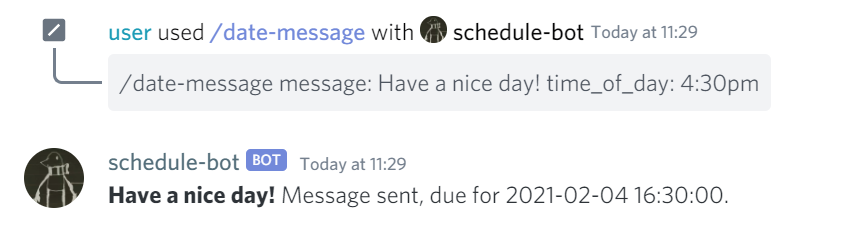

# scheduling-discord

## A discord bot used to send reminders to yourself using email
Can also be configured to email to SMS using an SMS gateway depending on the carrier. i.e. for Bell (Canada): 4161231234@txt.bell.ca 
[Attached is a list of SMS gateways depending on carrier](https://smsemailgateway.com/)

### Example input
- /date-message: Setting a reminder for a specific date/time

  
- /get-schedule: Get a list of scheduled tasks

### uses mongodb, gmail api and apscheduler to store, send and schedule messages
